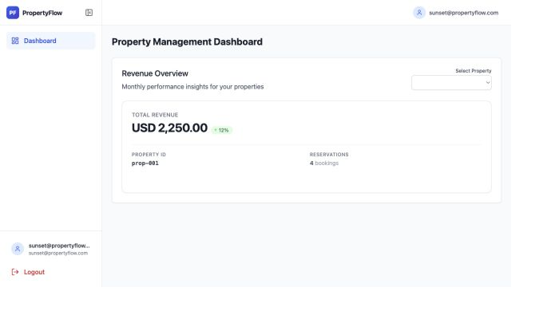
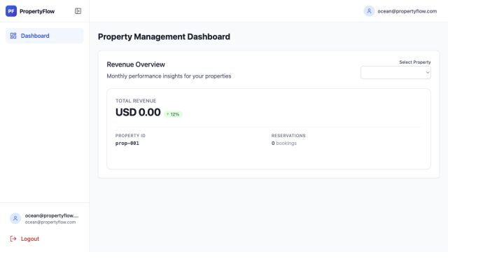

# Property Revenue Dashboard — Submission

## Issues found and fixed

### 1. Incorrect March revenue

Monthly boundaries were calculated without the property's timezone, which excluded reservations close to the start or end of a month. The calculation now builds the month in the property's local timezone and converts the boundaries to UTC for the database query.

### 2. Revenue exposed between clients

The cache key contained only the property ID, so properties with the same ID could share cached revenue across tenants. Cache keys and database queries are now scoped by both tenant ID and property ID.

### 3. Totals off by a few cents

Revenue used floating-point arithmetic, which is unsafe for currency. Calculations now use `Decimal` values with consistent half-up rounding to two decimal places.

## Additional fix

The async database-session configuration was corrected so the revenue service uses the configured database connection properly.

## Verification

- Backend syntax checks passed.
- Timezone, tenant-isolation, and currency-rounding regression checks passed.
- The existing application structure was preserved.

## Screenshots

### Sunset Properties — prop-001 (tenant A)

### Ocean Rentals — prop-001 (tenant B)

## Video walkthrough

Loom: _Add link before submission._

## Walkthrough script

### Screen 1 — Revenue calculation

Open `backend/app/services/reservations.py`.

Say: “The monthly range is created in the property’s timezone, then converted to UTC before querying. This fixes the March boundary calculation.”

### Screen 2 — Tenant isolation

Open `backend/app/services/cache.py`.

Say: “The cache key now includes both tenant ID and property ID, so two clients using the same property ID cannot share revenue data.”

### Screen 3 — Currency accuracy

Open `backend/app/services/reservations.py` at the revenue total calculation.

Say: “Revenue uses Decimal with half-up rounding to two places, preventing floating-point cent errors.”

### Screen 4 — Sunset dashboard

Open `http://localhost:3000/login`, sign in as `sunset@propertyflow.com`, choose **City Apartment Downtown**, and show `prop-002` with **USD 4,975.50** and **4 bookings**.

Say: “Sunset sees its own property list and the correct selected-property total.”

### Screen 5 — Ocean dashboard

Log out, sign in as `ocean@propertyflow.com`, choose **Lakeside Cottage**, and show `prop-004` with **USD 1,776.50** and **4 bookings**.

Say: “Ocean sees a separate property list and separate revenue, confirming tenant isolation.”

### Screen 6 — Submission

Open this `SUBMISSION.md` file.

Say: “These are the three reported bugs, the fixes, and the verification evidence.”
